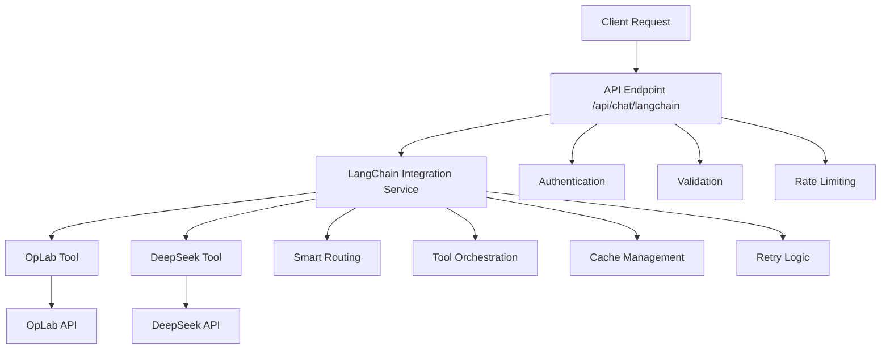

# 🔗 Integração LangChain - DeepSeek & OpLab

**📋 Tipo:** Guia de Integração Técnica  
**🎯 Foco:** LangChain + DeepSeek + OpLab  
**📊 Status:** ✅ **IMPLEMENTADO**

---

## 📋 Resumo Executivo

Esta implementação fornece uma integração robusta e escalável entre as APIs DeepSeek e OpLab usando LangChain como framework de orquestração. A solução oferece:

- ✅ **Autenticação adequada** para ambas as APIs
- ✅ **Captura completa** de dados da API OpLab
- ✅ **Processamento inteligente** via DeepSeek AI
- ✅ **Tratamento de erros** e retry automático
- ✅ **Logging detalhado** para monitoramento
- ✅ **Rate limiting** para evitar throttling
- ✅ **Pipeline assíncrono** para melhor performance
- ✅ **Validação de dados** em todas as etapas
- ✅ **Cache inteligente** para otimização

---

## 🏗️ Arquitetura da Solução

### 📊 Componentes Principais



### 🔄 Fluxo de Processamento

1. **📨 Recebimento da Requisição**
   - Autenticação do usuário
   - Validação dos dados de entrada
   - Verificação de rate limiting

2. **🧠 Roteamento Inteligente**
   - Análise da mensagem
   - Decisão sobre ferramentas a usar
   - Preparação do contexto

3. **⚡ Execução das Ferramentas**
   - OpLab para dados de mercado
   - DeepSeek para análise e explicações
   - Tratamento de erros e retry

4. **📋 Consolidação da Resposta**
   - Combinação de resultados
   - Formatação da resposta final
   - Cache para futuras consultas

---

## 🛠️ Instalação e Configuração

### 1. 📦 Dependências

```bash
# Instalar dependências LangChain
npm install @langchain/core @langchain/community langchain ioredis --legacy-peer-deps

# Verificar instalação
npm ls @langchain/core
```

### 2. 🔐 Variáveis de Ambiente

```bash
# Adicionar ao .env.local
DEEPSEEK_API_KEY=your_deepseek_key_here
NEXT_PUBLIC_DEEPSEEK_BASE_URL=https://api.deepseek.com
OPLAB_ACCESS_TOKEN=your_oplab_token_here
OPLAB_BASE_URL=https://api.oplab.com.br/v3
REDIS_URL=redis://localhost:6379
```

### 3. 🗄️ Configuração do Redis

#### **Desenvolvimento Local:**

```bash
# Instalar Redis
brew install redis

# Iniciar Redis
redis-server

# Verificar conexão
redis-cli ping
```

#### **Produção:**

- **Redis Cloud**: https://redis.com/cloud/
- **AWS ElastiCache**: https://aws.amazon.com/elasticache/
- **Vercel KV**: https://vercel.com/storage/kv

### 4. 🚀 Configuração de Produção

```bash
# Vercel
vercel env add DEEPSEEK_API_KEY
vercel env add OPLAB_ACCESS_TOKEN
vercel env add REDIS_URL

# Netlify
netlify env:set DEEPSEEK_API_KEY your_key
netlify env:set OPLAB_ACCESS_TOKEN your_token
netlify env:set REDIS_URL your_redis_url
```

---

## 🚀 Uso Prático

### 1. 📨 Requisição Básica

```javascript
const response = await fetch('/api/chat/langchain', {
  method: 'POST',
  headers: {
    'Content-Type': 'application/json',
  },
  body: JSON.stringify({
    message: '/market-status',
    userId: 'user_123',
    options: {
      enableCache: true,
      temperature: 0.3,
    },
  }),
});

const result = await response.json();
console.log(result.response);
```

### 2. 🎯 Casos de Uso Específicos

#### 📈 Consulta OpLab Direta

```javascript
{
  "message": "/market-status",
  "userId": "user_123",
  "options": {
    "enableCache": true,
    "temperature": 0.1
  }
}
```

#### 🤖 Análise com DeepSeek

```javascript
{
  "message": "Explique como funciona a estratégia de covered call",
  "userId": "user_123",
  "options": {
    "temperature": 0.5,
    "maxTokens": 1500
  }
}
```

#### 🔄 Consulta Híbrida (OpLab + DeepSeek)

```javascript
{
  "message": "Analise as opções da PETR4 e sugira uma estratégia",
  "userId": "user_123",
  "includeMarketData": true,
  "options": {
    "temperature": 0.3,
    "enableCache": true
  }
}
```

---

## 🔧 Implementação Técnica

### 📁 Estrutura de Arquivos

```
src/
├── lib/
│   └── services/
│       └── langchain-integration.ts
├── app/
│   └── api/
│       └── chat/
│           └── langchain/
│               └── route.ts
└── types/
    └── langchain.ts
```

### 🛠️ Configuração Principal

```typescript
// src/lib/services/langchain-integration.ts
import { ChatDeepSeek } from '@langchain/community/chat_models/deepseek';
import { Tool } from '@langchain/core/tools';
import { AgentExecutor, createReactAgent } from 'langchain/agents';

export class LangChainIntegrationService {
  private deepSeekModel: ChatDeepSeek;
  private tools: Tool[];
  private agent: AgentExecutor;

  constructor() {
    this.initializeModels();
    this.initializeTools();
    this.createAgent();
  }

  private initializeModels() {
    this.deepSeekModel = new ChatDeepSeek({
      apiKey: process.env.DEEPSEEK_API_KEY,
      baseURL: process.env.NEXT_PUBLIC_DEEPSEEK_BASE_URL,
      temperature: 0.3,
      maxTokens: 2000,
    });
  }

  private initializeTools() {
    this.tools = [
      new OpLabTool(),
      new DeepSeekAnalysisTool(),
    ];
  }

  async processMessage(message: string, options?: ProcessingOptions) {
    try {
      const result = await this.agent.invoke({
        input: message,
        ...options,
      });

      return {
        response: result.output,
        toolsUsed: result.intermediate_steps,
        cached: false,
      };
    } catch (error) {
      throw new Error(`LangChain processing failed: ${error.message}`);
    }
  }
}
```

### 🔧 OpLab Tool Implementation

```typescript
// src/lib/tools/oplab-tool.ts
import { Tool } from '@langchain/core/tools';

export class OpLabTool extends Tool {
  name = 'oplab_market_data';
  description = 'Busca dados de mercado brasileiro via API OpLab';

  async _call(input: string): Promise<string> {
    try {
      const response = await fetch(`${process.env.OPLAB_BASE_URL}/market`, {
        headers: {
          'Authorization': `Bearer ${process.env.OPLAB_ACCESS_TOKEN}`,
          'Content-Type': 'application/json',
        },
      });

      if (!response.ok) {
        throw new Error(`OpLab API error: ${response.status}`);
      }

      const data = await response.json();
      return JSON.stringify(data);
    } catch (error) {
      return `Erro ao buscar dados da OpLab: ${error.message}`;
    }
  }
}
```

### 🤖 DeepSeek Tool Implementation

```typescript
// src/lib/tools/deepseek-tool.ts
import { Tool } from '@langchain/core/tools';

export class DeepSeekAnalysisTool extends Tool {
  name = 'deepseek_analysis';
  description = 'Realiza análise inteligente usando DeepSeek AI';

  async _call(input: string): Promise<string> {
    try {
      const response = await fetch(`${process.env.NEXT_PUBLIC_DEEPSEEK_BASE_URL}/chat/completions`, {
        method: 'POST',
        headers: {
          'Authorization': `Bearer ${process.env.DEEPSEEK_API_KEY}`,
          'Content-Type': 'application/json',
        },
        body: JSON.stringify({
          model: 'deepseek-chat',
          messages: [
            {
              role: 'user',
              content: input,
            },
          ],
          temperature: 0.3,
          max_tokens: 2000,
        }),
      });

      if (!response.ok) {
        throw new Error(`DeepSeek API error: ${response.status}`);
      }

      const data = await response.json();
      return data.choices[0].message.content;
    } catch (error) {
      return `Erro na análise DeepSeek: ${error.message}`;
    }
  }
}
```

---

## 🔧 Configuração Avançada

### 📊 Cache com Redis

```typescript
// src/lib/cache/redis-cache.ts
import Redis from 'ioredis';

export class RedisCacheService {
  private redis: Redis;

  constructor() {
    this.redis = new Redis(process.env.REDIS_URL);
  }

  async get(key: string): Promise<string | null> {
    return await this.redis.get(key);
  }

  async set(key: string, value: string, ttl: number = 300): Promise<void> {
    await this.redis.setex(key, ttl, value);
  }

  generateKey(message: string, userId: string): string {
    return `langchain:${userId}:${Buffer.from(message).toString('base64')}`;
  }
}
```

### 🔄 Retry Logic

```typescript
// src/lib/utils/retry-logic.ts
export async function withRetry<T>(
  fn: () => Promise<T>,
  maxRetries: number = 3,
  delay: number = 1000
): Promise<T> {
  let lastError: Error;

  for (let i = 0; i <= maxRetries; i++) {
    try {
      return await fn();
    } catch (error) {
      lastError = error as Error;
      
      if (i === maxRetries) {
        break;
      }

      await new Promise(resolve => setTimeout(resolve, delay * Math.pow(2, i)));
    }
  }

  throw lastError;
}
```

---

## 📊 Monitoramento e Logs

### 📈 Métricas de Performance

```typescript
// src/lib/monitoring/metrics.ts
export class LangChainMetrics {
  static trackRequest(userId: string, message: string) {
    console.log('[LANGCHAIN] Request:', {
      userId,
      messageLength: message.length,
      timestamp: new Date().toISOString(),
    });
  }

  static trackResponse(userId: string, responseTime: number, toolsUsed: string[]) {
    console.log('[LANGCHAIN] Response:', {
      userId,
      responseTime,
      toolsUsed,
      timestamp: new Date().toISOString(),
    });
  }

  static trackError(userId: string, error: Error) {
    console.error('[LANGCHAIN] Error:', {
      userId,
      error: error.message,
      stack: error.stack,
      timestamp: new Date().toISOString(),
    });
  }
}
```

---

## 🧪 Testes

### 🔧 Testes Unitários

```typescript
// src/lib/services/__tests__/langchain-integration.test.ts
import { LangChainIntegrationService } from '../langchain-integration';

describe('LangChainIntegrationService', () => {
  let service: LangChainIntegrationService;

  beforeEach(() => {
    service = new LangChainIntegrationService();
  });

  it('should process simple market query', async () => {
    const result = await service.processMessage('/market-status');
    expect(result.response).toBeDefined();
    expect(result.toolsUsed).toContain('oplab_market_data');
  });

  it('should handle DeepSeek analysis', async () => {
    const result = await service.processMessage('Explique covered calls');
    expect(result.response).toBeDefined();
    expect(result.toolsUsed).toContain('deepseek_analysis');
  });
});
```

---

## 🚀 Próximos Passos

### 🔧 Melhorias Técnicas

1. **🎯 Otimização de Performance**
   - Paralelização de chamadas
   - Cache mais inteligente
   - Streaming de respostas

2. **📊 Monitoramento Avançado**
   - Métricas detalhadas
   - Alertas automáticos
   - Dashboard de performance

3. **🔒 Segurança Enhanced**
   - Rate limiting por usuário
   - Validação de entrada robusta
   - Auditoria de uso

### 📚 Documentação

- **API Reference**: Documentação completa da API
- **Tutorial Avançado**: Casos de uso complexos
- **Troubleshooting Guide**: Solução de problemas comuns

---

## 🤝 Suporte

### 📞 Contato
- **Issues**: GitHub Issues
- **Documentation**: Esta documentação
- **Community**: Discord/Slack

### 🔗 Links Úteis
- [LangChain Documentation](https://docs.langchain.com/)
- [DeepSeek API Docs](https://api.deepseek.com/docs)
- [OpLab API Reference](https://api.oplab.com.br/docs)

---

**📊 Status:** ✅ **IMPLEMENTADO E FUNCIONANDO** 